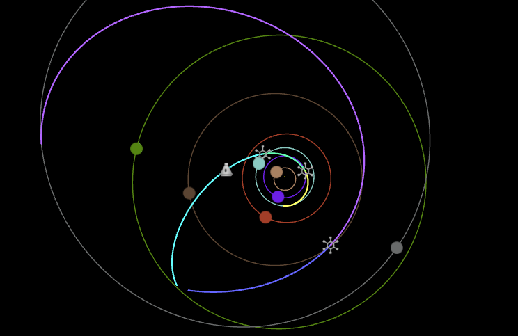

# Multiple Gravity Assist Trajectory Planner for KSP

An online tool providing automatic design of trajectories with multiple gravity assists for Kerbal Space Program.



## Dependencies

This project was developed on [Visual Studio Code](https://code.visualstudio.com/).  
It requires type definitions for [THREE.js](https://github.com/mrdoob/three.js/), [Chart.js](https://github.com/chartjs)
and [js-yaml](https://github.com/nodeca/js-yaml). They can be obtained with the following commands:

```cmd
npm install --save-dev @types/three
npm install --save-dev @types/js-yaml
npm install --save-dev @types/chart.js
```

This project also includes [THREE.js example classes](https://github.com/mrdoob/three.js/tree/dev/examples/js) for line rendering and camera control.
In order to have the TypeScript compiler recognize them, the following lines must be addded to
`node_modules/@types/three/src/Three.d.ts`:

```js
/* Examples imports */
/* Example lines */
export * from '../examples/jsm/lines/Line2';
export * from '../examples/jsm/lines/LineGeometry';
export * from '../examples/jsm/lines/LineMaterial';
/* OrbitControls */
export * from '../examples/jsm/controls/OrbitControls';
```

## Solar systems support

The tool can support any solar system configuration. You can contribute to add support for solar systems from known mods.

1. Fork this project and create a new branch for your solar system.
2. Create a new folder in `data` for your system with a `config.yml`
and `bodies.yml` file following the templates in `data/stock`.
    - `config.yml` stores the global configurations of the tool. These parameters may need
    to be changed depending on the characteristics of the solar system (e.g. duration of a day,
    camera clip distances for large solar systems...).
    - `bodies.yml` stores the description of each bodies in the solar system. It must
    rigorously follow the template format. If your solar
    system uses Kopernicus configuration files, you can directly convert them into
    a `bodies.yml` file via [this page](https://krafpy.github.io/KSP-MGA-Planner/tools/cfg-to-yml/).
3. Add an entry to `data/systems.yml` for your solar system.
4. **Test the tool** locally with your system (run the tool on a local HTTP server),
check for the coherence of results and ingame feasibility.
5. Create a pull request to this repository.

## Used resources

- Ceriotti, Matteo (2010) Global optimisation of multiple gravity assist trajectories. PhD thesis.
- Orbital Mechanics for Engineering Students by Howard D. Curtis
- [René Schwarz' website](https://www.rene-schwarz.com/web/Home) and his Memorandum Series
- [Astrodynamics Wikibook](https://en.wikibooks.org/wiki/Astrodynamics)
- [ESA's Lambert Solver script](https://github.com/esa/pykep/blob/master/src/lambert_problem.cpp) for pykep
- [Space Exploration StackExchange](https://space.stackexchange.com/) (more precisely [this](https://space.stackexchange.com/questions/54414/how-to-calculate-the-velocity-vector-in-the-case-of-a-hyperbolic-orbit) and [this](https://space.stackexchange.com/questions/54448/calculating-the-time-of-flight-between-two-anomalies-gives-a-negative-result) post)
